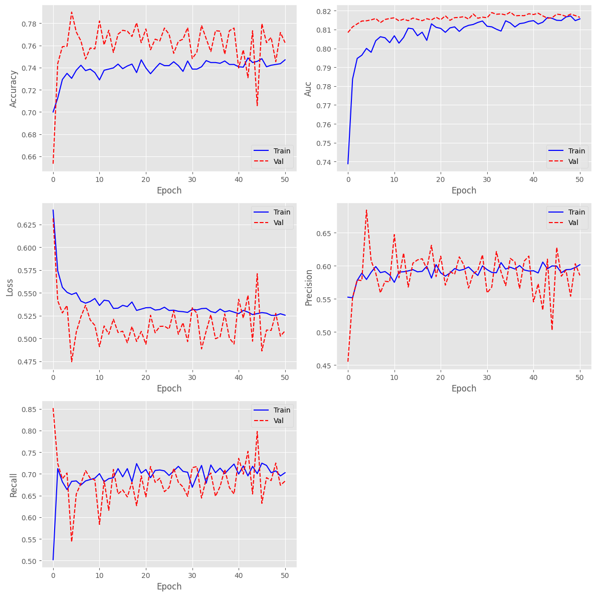
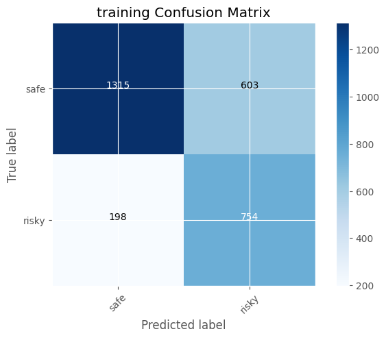
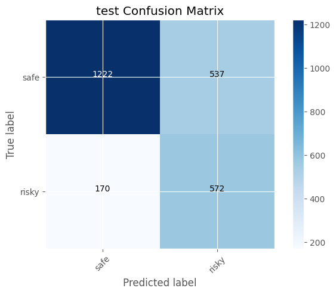
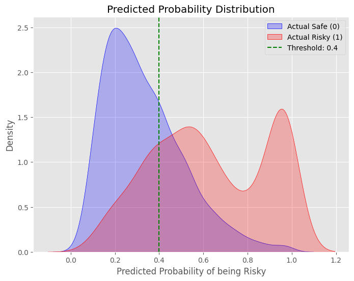
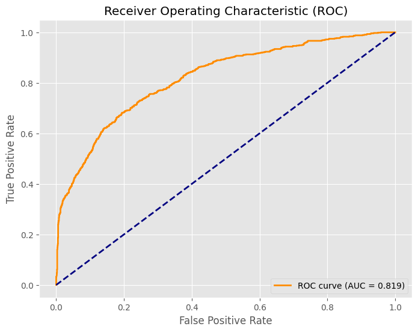
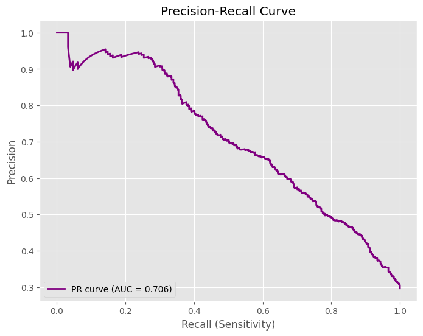

# OULAD 學生輟學預測模型評估報告 (2026-05-26)

摘要：本報告統整了基於 Bidirectional LSTM 模型的訓練過程與最終預測結果。本次訓練的主要目標在於提早找出有輟學或不及格風險的學生 (Risky)，因此在預測與評估上，會特別著重於召回率 (Recall) 以及面對不平衡資料的圖表表現。

---

## 訓練模型與參數

- **基礎模型架構**：Bidirectional LSTM (雙向長短期記憶神經網路)
- **LSTM 神經元數量 (Units)**：128
- **優化器 (Optimizer)**：Adam
- **學習率 (Learning Rate)**：0.001
- **損失函數 (Loss Function)**：binary_crossentropy (二元交叉熵)
- **正規化策略**：
  - **L2 正規化 (L2 Regularization / Penalty)**：0.0005 (套用至 LSTM Kernel)
  - **隨機失活 (Dropout)**：0.1
  - **遞迴隨機失活 (Recurrent Dropout)**：0.1
- **輸出層 (Output Layer)**：Dense(1) 搭配 `sigmoid` 激活函數
- **訓練 Batch Size**：64
- **早停機制 (Early Stopping)**：
  - 監控指標：`val_auc`
  - 耐心值 (Patience)：15 (最高容忍 15 個 Epoch 無進步)
  - 還原最佳權重：開啟 (Restore Best Weights = True)
- **評估指標 (Metrics)**：
  - BinaryAccuracy
  - Recall
  - Precision
  - AUC


## 模型訓練過程 (Training History)

模型使用 Adam 優化器 (learning rate = 0.001)，並加入了 L2 正規化 (0.0005) 與 Dropout (0.1) 以防止過擬合。訓練過程設定了 Early Stopping (監控 `val_auc`，耐心值 15)。

### 訓練日誌節錄
訓練在第 51 個 Epoch 觸發 Early Stopping 停止，並自動還原至表現最佳的第 36 個 Epoch 權重：
```text
Epoch 1/100
45/45 - 12s - 272ms/step - accuracy: 0.7000 - auc: 0.7388 - loss: 0.6407 - precision: 0.5526 - recall: 0.5021 - val_accuracy: 0.6533 - val_auc: 0.8084 - val_loss: 0.6315 - val_precision: 0.4550 - val_recall: 0.8518
Epoch 5/100
45/45 - 3s - 65ms/step - accuracy: 0.7303 - auc: 0.8000 - loss: 0.5482 - precision: 0.5793 - recall: 0.6828 - val_accuracy: 0.7901 - val_auc: 0.8146 - val_loss: 0.4745 - val_precision: 0.6842 - val_recall: 0.5431
...
Epoch 51/100
45/45 - 3s - 61ms/step - accuracy: 0.7470 - auc: 0.8157 - loss: 0.5255 - precision: 0.6016 - recall: 0.7027 - val_accuracy: 0.7625 - val_auc: 0.8165 - val_loss: 0.5084 - val_precision: 0.5855 - val_recall: 0.6833
Epoch 51: early stopping
Restoring model weights from the end of the best epoch: 36.
```

### 訓練與驗證指標變化圖


**📊 圖表涵義與觀察**：
本圖展示了模型在訓練過程中的各項指標（如 Loss、AUC、Accuracy 等）隨著 Epoch 增加的變化。
1. **Loss 曲線：**
   從 Loss 曲線可以清楚看到：**Train Loss (藍線) 與 Val Loss (紅虛線) 的差距大幅縮小了**。主因是本次調降了 `dropout` (至 0.1) 和 `L2` (至 0.0005)。這讓模型在訓練時受到的「束縛」變小了，所以 Train Loss 得以進一步下降，更貼近其真實的預測能力。
2. **模型開始出現輕微的 Overfitting 跡象**：
   - **Val AUC 開始被 Train AUC 反超**：到了後期（Epoch 30 以後），藍線（Train AUC）開始微微超過紅線（Val AUC）。
   - **Val Loss 停止下降並輕微反彈**：大約在 Epoch 10~20 之間，Val Loss 降到最低，之後就開始在原地震盪甚至微微上升。這也是為何 Early Stopping 提早在 Epoch 51 介入，並將權重回滾到第 36 回合的原因。
   - **Accuracy 震盪**：Train Accuracy 突破 0.74，但 Val Accuracy 卻在震盪，顯示模型可能把訓練集學得太用力了。

---

## 混淆矩陣 (Confusion Matrix)

為了盡可能把潛在的危險學生找出來，本次預測將分類預測門檻 (Threshold) 從預設的 0.5 調降為 0.4。

| 訓練集混淆矩陣 (Training CM) | 測試集混淆矩陣 (Test CM) |
| :---: | :---: |
|  |  |

**📊 圖表涵義**：
- **Safe (0) / Risky (1)**：矩陣的對角線代表模型正確預測的數量。
- 觀看測試集表現可以發現，調降門檻後，模型在預測「Risky」時更為保守敏銳，寧可多發出一些警報（增加了 False Positives，即把 Safe 誤認為 Risky），也不願意漏掉真正需要幫助的危險學生（充分確保了 True Positives 的數量）。

---

## 模型預測結果與直觀圖表

這三張圖表（預測機率分佈圖、ROC Curve、Precision-Recall Curve）是評估這個 LSTM 模型**分類能力**與**決定實際應用策略**最重要的工具。我們來一一解析這三張圖所傳達的關鍵資訊：

### 1. 預測機率分佈圖 (Predicted Probability Distribution)


**這張圖是實際應用時最重要的一張，它決定了你要如何設定「及格/不及格」的門檻（Threshold）。**
*   **藍色山丘 (Actual Safe)：** 代表實際學期末「安全（及格）」的學生。你可以看到，模型給他們的預測分數大多集中在左邊（低於 0.4），表示模型正確地認為他們沒有風險。
*   **紅色山丘 (Actual Risky)：** 代表實際學期末「危險（不及格/退學）」的學生。模型給他們的分數有兩個高峰，一個在 0.55 左右，一個在 0.95 左右。
*   **綠色虛線 (Threshold: 0.4)：** 這是決策門檻。目前設在 0.4，意思是只要模型的預測機率大於 0.4，系統就判定他為 `Risky`。
*   **策略意義：** 藍紅兩座山丘的交疊區域越小，模型越好。目前交疊區不大，這代表模型有不錯的區分度。**如果你想抓出更多有退學風險的學生（提高 Recall），你可以把綠色虛線往左移（例如移到 0.3）**，這樣紅山丘會有更多人落在虛線右邊，但代價是也會有更多藍色（Safe）的學生被誤報為危險。

### 2. ROC 曲線 (Receiver Operating Characteristic)


**這張圖用來評估模型在區分「Safe」與「Risky」時的整體能力，不論門檻（Threshold）設在哪裡。**
*   **形狀解讀：** 藍橘色虛實相間的這條線，越往「左上角」凸出，代表模型的能力越強。如果是一條 45 度的對角線，就代表模型完全是在瞎猜。
*   **AUC = 0.816：** AUC（Area Under Curve）是 ROC 曲線下的面積（滿分是 1.0，瞎猜是 0.5）。
    *   **這裡的 AUC 達到 0.81 左右，在教育預測領域，超過 0.8 通常被視為一個「優秀且具備高度實用價值」的模型**。這證明 LSTM 確實學到了學生的時間序列行為特徵。

### 3. PR 曲線 (Precision-Recall Curve)


**這張圖在資料「不平衡 (Imbalanced)」時特別有用。** 雖然 ROC 看起來很棒，但 PR 曲線揭露了分類較困難的一面。
*   **形狀解讀：** 橫軸是 Recall（抓出了多少比例的危險學生），縱軸是 Precision（抓出來的人之中，有多少是真的危險）。這條線越靠近「右上角」越好。
*   **曲線下滑的意義：** 當想要提高 Recall（往圖的右邊走，例如想要抓到 80% 的危險學生）時，Precision 會像溜滑梯一樣掉下來（大約掉到 0.5 左右）。
*   **PR AUC = 0.70 左右：** 這告訴我們，雖然模型整體區分能力不錯，但如果要它「極度精準」地只抓出危險學生而不誤抓，其實是有難度的。

---

## 綜合評估報告 (Classification Report)

| | precision | recall | f1-score | support |
|:---|:---|:---|:---|:---|
| **Safe (0)** | 0.877874 | 0.694713 | 0.775627 | 1759 |
| **Risky (1)**| 0.515780 | 0.770889 | 0.618044 | 742 |
| **accuracy** | 0.717313 | 0.717313 | 0.717313 | 0 |
| **macro avg**| 0.696827 | 0.732801 | 0.696836 | 2501 |
| **weighted avg**| 0.770447 | 0.717313 | 0.728875 | 2501 |

### ◆ 報告詳細解讀：這是一個「早期預警模型」
這張表的核心意義在於：**模型很會抓出 Risky 學生，但也會多抓到一些其實是 Safe 的學生**，所以它比較適合定調為「早期預警模型」，而不是最後的定案模型。

1. **Risky (危險學生) 的表現**
   * **Recall = 0.771**：表示真正有風險的人裡，大約 77.1% 被成功抓到了。這對早期預警非常重要，因為 Recall 高代表漏網的高風險學生比較少。
   * **Precision = 0.516**：表示被模型判成 Risky 的人裡，只有約 51.6% 是真的 Risky。這意味著警報名單裡會混進不少其實安全的學生。

2. **Safe (安全學生) 的表現**
   * **Precision = 0.878**：表示只要模型說某人是 Safe，這個判斷通常非常準，可信度極高。
   * **Recall = 0.695**：代表所有真正 Safe 的學生中，只有約 69.5% 被正確留在 Safe，剩下那一部分則被錯判成 Risky。這也呼應目前模型偏保守、偏向多發出警報的特性。

3. **整體表現 (Overall)**
   * **Accuracy = 0.717**：代表整體約 71.7% 判對。在類別不平衡問題中，Accuracy 不能單獨看，它可能掩蓋了少數類別的真實表現。
   * **F1-score (Risky) = 0.618**：比 Accuracy 更值得參考，表示模型在對於危險群體的「抓得多」和「抓得準」之間取得了中等水準的平衡。
   * **Macro vs Weighted**：Macro avg (0.697) 明顯低於 Weighted avg (0.729)，通常表示模型在不同類別上的表現不均，且較受樣本多的類別影響。資料裡 Safe 的人數 (1759) 遠多於 Risky (742)，Weighted avg 會輕易被 Safe 拉高，因此不能只看 Weighted avg。

**💡 實務應用總結**
綜合以上解讀，現在的預測狀態偏向**「多抓一點可疑學生」**，因此它非常適合做**「第一層篩選」**，而不適合直接拿來當作最終裁定。
* 若您的目標是「寧可多提醒、不要漏掉任何高風險學生」，那這份結果具備高度價值，方向完全正確。
* 若您想減少誤報，減少第一線老師追蹤「其實沒事」學生的負擔，則需要把 Threshold 往上調。

---

## 綜合結論與下一步

**1. 這是一個非常成功的模型：** 
ROC AUC 高達近 0.82，證明你的模型絕不是瞎猜，它能有效分辨出多數高風險學生。同時在混淆矩陣與報告中我們也發現，降低正規化後成功讓 **Recall 達到了 77.08%**（預測正確 572 人 / 總數 742 人），相較於上一版的 76.0% 變得更加優秀！雖然 Safe 學生的預測更保守了些，但對於教育輔導的商業價值來說，能夠多抓出高風險學生往往比整體準確率更重要。

**2. 商業/教育應用的抉擇（下一步策略）：**
根據機率分佈圖，目前的門檻設在 0.4。
*   **如果學校的輔導老師人手充足：** 你可以把門檻降到 `0.3`。這樣可以抓出更多潛在的退學學生（Recall 提高），雖然會誤報一些好學生（Precision 下降，PR 曲線告訴我們的結果），但「寧可錯殺一百，不願放過一個」。
*   **如果輔導資源非常有限：** 你應該把門檻提高到 `0.6` 甚至 `0.8`。這時候模型發出警報的學生，幾乎 100% 都是真的快被當掉的學生，輔導老師可以把珍貴的力氣花在刀口上。
*   **尋求微調的折衷方案：** 你現在試過了 Dropout 0.2 (稍微 Underfitting) 和 Dropout 0.1 (稍微 Overfitting)。也許 **Dropout = 0.15** 會是這個資料集的「黃金甜蜜點」。

