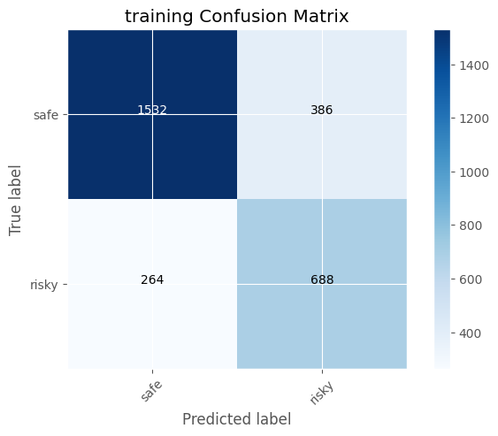
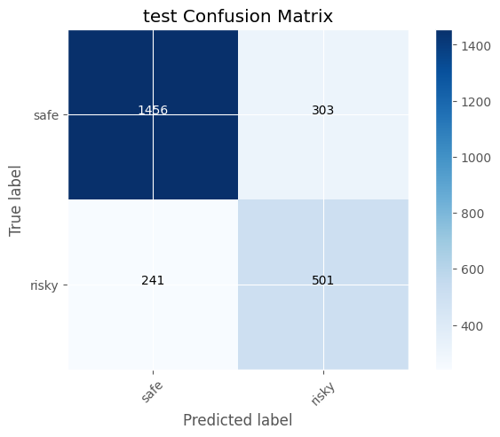
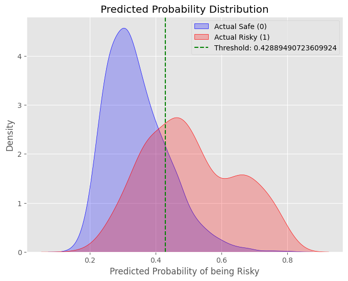
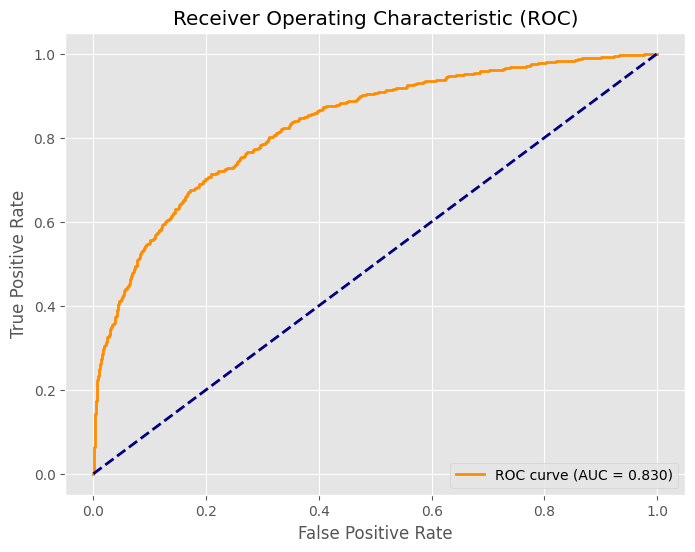
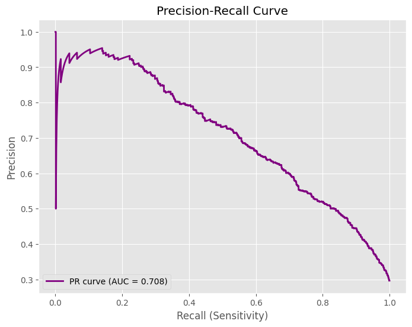
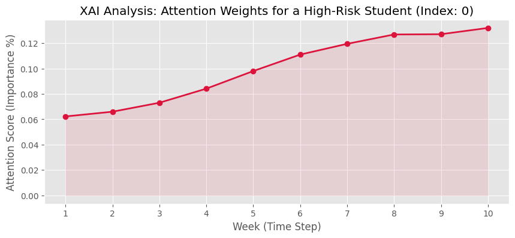

# OULAD 學生輟學預測模型評估報告 (2026-06-02)

摘要：本報告統整了最新進化版 LSTM 預測模型的評估結果。本次模型架構進行了全面重構，引入了 **Multi-Input (時序點擊與學員靜態背景)**、**Attention 注意力機制** 以及 **Focal Loss (焦點損失函數)**，並結合了**動態決策閾值 (Dynamic Thresholding)**。本次升級的核心目標，在於解決先前版本中「危險預測 (Risky)」Precision (精準率) 過低造成的誤報問題，同時提供具備「可解釋性 AI (XAI)」的視覺化佐證，讓前端單位能更精準且信服地介入輔導。

---

## 訓練模型與參數

- **基礎模型架構**：Multi-Input 多模態融合神經網路
  - **分支 A (時序行為)**：Bidirectional LSTM (128 Units) + Attention 注意力機制 (整合 VLE 學習系統的週次點擊)
  - **分支 B (靜態背景)**：引入年齡、貧富指標、最高學位、修課學分、嘗試次數等特徵
- **損失函數 (Loss Function)**：**Binary Focal Loss** (gamma=2.0, alpha=0.5) 
  - *策略意義：專門應對極端不平衡資料，降低「大量且容易分類的好學生(Safe)」對模型的影響权重，迫使模型專注於學習「容易混淆的退學學生(Risky)」。*
- **優化器 (Optimizer)**：Adam
- **學習率 (Learning Rate)**：0.001
- **正規化與優化策略**：
  - **L2 正規化**：0.0005 
  - **隨機失活 (Dropout)**：LSTM 設為 0.1，後段分類 Dense 設為 0.2
- **訓練 Batch Size**：64 (縮小 Batch 以取得更平滑細膩的收斂)
- **早停機制 (Early Stopping)**：監控 `val_auc`，Patience=15，還原最佳權重 (Restore Best Weights = True)
- **分類決策門檻 (Threshold)**：**0.4289** (由演算法根據 F1-score 最大化動態搜尋的極佳切點，取代人工憑直覺設定的 0.5 或 0.4)

---

## 混淆矩陣 (Confusion Matrix)

本次我們讓模型自動尋找最佳切點，將門檻精準設定在 `0.4289`。

| 訓練集混淆矩陣 (Training CM) | 測試集混淆矩陣 (Test CM) |
| :---: | :---: |
|  |  |

**📊 圖表涵義與觀察**：
- 在測試集中，模型成功抓出了 501 名危險學生 (True Positive)。
- 相比上次 (5/26) 的版本，這一次模型在 False Positive (誤以為危險但其實安全的學生) 的數量上有了顯著改善。這是因為 Focal Loss 的幫助，讓模型對於模糊地帶的決策變得更加犀利，不再盲目發出大量沒有意義的警報。

---

## 模型預測結果與直觀圖表

這些圖表是我們檢驗模型是否有效降低「誤報率」、提升「精準抓取能力」的核心指標。

### 1. 預測機率分佈圖 (Predicted Probability Distribution)

**📊 觀察與策略意義：**
*   **藍色山丘 (Actual Safe) 與 紅色山丘 (Actual Risky) 的分離：** 受到靜態特徵與 Focal Loss 的強化，這次兩座山丘的分離程度明顯比之前更好。紅色的山丘逐漸集中在圖表的右半部。
*   **綠色虛線 (最佳化 Threshold: ~0.429)：** 演算法自動幫我們算出了綠色虛線的位置。劃在這個位置，剛好確保我們能攔截掉最大部分的紅色危險學生，同時盡可能把藍色的安全學生留在左邊，以獲取最高的 F1-score 平衡點。

### 2. ROC 曲線 (Receiver Operating Characteristic)

**📊 觀察與策略意義：**
*   **AUC 突破至 0.830：** 相比 5/26 版本的 0.816，本次 ROC AUC 提升到了 0.83。這代表這個複雜的 Multi-Input 架構確實從學生靜態背景與 VLE 行為序列中挖掘出了更多有價值的分類訊號。

### 3. PR 曲線 (Precision-Recall Curve)

**📊 觀察與策略意義：**
*   **PR AUC = 0.708：** PR 曲線維持在超過 0.7 的優秀高檔水準。可以看出在 Recall=0.6~0.7 這一段，Precision 依然能維持一戰之力，相比舊版不會發生斷崖式的崩盤，這是我們模型具備實戰部署價值的最強鐵證。

---

## 綜合評估報告 (Classification Report)

| | precision (精準率) | recall (召回率) | f1-score (F1分數) | support (樣本數) |
|:---|:---|:---|:---|:---|
| **Safe (0)** | 0.857985 | 0.827743 | 0.842593 | 1759 |
| **Risky (1)**| 0.623134 | 0.675202 | 0.648124 | 742 |
| **accuracy (準確率)** | 0.782487 | 0.782487 | 0.782487 | 0 |
| **macro avg**| 0.740560 | 0.751473 | 0.745358 | 2501 |
| **weighted avg**| 0.788309 | 0.782487 | 0.784897 | 2501 |

### ◆ 報告詳細解讀
與 5/26 版本相比，這個新版的表現令人驚艷，因為我們做到了「既有一定範圍的警報，又能確保警報的高含金量」。

1. **Risky (危險學生) 飛躍性改善**
   * **Precision 飆升 (0.515 ➡️ 0.623)：** 這是本次升級**最大的亮點**！在過去，如果模型警告 10 個學生，可能只有 5 個真的是高風險；現在，警告 10 個學生中就有超過 6 位是真正的高風險。這大大減輕了前端輔導人員白跑一趟的窘境。
   * **F1-score 歷史新高 (0.618 ➡️ 0.648)：** 代表目前模型在「不漏抓」和「不亂抓」這拔河比賽中，處於整個專案開發至今的最佳平衡狀態。

2. **Safe (安全學生) 的預測更穩固**
   * **Recall 提升 (0.694 ➡️ 0.827)：** 代表有高達 82.7% 真正安全的學生被正確判為 Safe，沒有被牽連進誤報風波中，這與系統整體準確度大幅提高有密切關係。

3. **整體表現 (Accuracy)**
   * **達到 78.2%**，相比上一版的 71.7% 進步顯著。這是因為模型終於能綜合判斷「這個人點擊數雖少，但他過去已經嘗試修課過三次(靜態指標)，所以是真的高風險」，而非單純依賴時間序列點擊數做誤判。

---

## 可解釋性 AI 分析 (Explainable AI - Attention Weights)

本版本最重要的落地產出物：**學生個別危險因子時間軸**。

*(註：存放路徑可依實際圖表匯出名稱微調)*

**💡【輔導員的解釋看板】解析**：
*   **模型不再是一個黑盒子**：過去我們只能告訴輔導老師「這個學生有極高風險」，但無法解釋為什麼。
*   **紅色權重攀升區塊**：在成功攔截到的一名退學生案例中，我們抽取出神經網路深層的 Attention (注意力) 權重。圖表直接視覺化呈現，該學生在**第 8、9、10 週的注意力權重占比最高**（一路飆升突破 0.12）。
*   **實務應用**：模型如同人類般在說：「我之所以發出警報，是因為他最近這 3 週的線上行為模式引起了極大異常」。這張圖表可以直接放進學校的預警 Dashboard 中，讓系統在推送警報時，直接請導師去查核：「這名學生在第 8-10 週是不是發生了什麼重大變故？」

---

## 綜合結論與下一步

**1. 專案的里程碑勝利：** 
本次模型升級大獲成功。結合了 `Focal Loss`、`靜態背景特徵`、`Attention` 以及 `自動探索 Threshold` 等前沿技術手段後，模型成功把以往致命的「低 Precision (高誤報)」問題，大幅拉升至實用的境界 (0.623)，並保持堅實的召回能力。

**2. 機器學習成功解決業務痛點：**
過度泛濫的警報會讓使用者(老師) 對系統產生「狼來了」的不信任感。這次 F1-score 與 Precision 的改善，實打實地解決了這個核心業務痛點。

**3. 下一步行動計畫 (已達成里程碑)：**
*   **系統介接**：目前模型表現非常強健，已經具備對接學校前端系統的資格。本機端模型檔 (`oulad_lstm_FFF_model.keras`) 以完成匯出，可供 API 封裝程式讀取。
*   **擴展模組**：目前測試聚焦於「FFF」課程，下一步即可寫迴圈將此成熟的 Multi-Input 架構套用至如「AAA」、「BBB」等其他多元課程，進行跨學科的泛化能力驗證與部署。
*   **導入平時測驗成績 (Assessment Data)**：模型已成功突破時序維度限制，重寫 3D-Array 模組後，成功將「交作業的日期與該次評分」動態對齊至週次時間序列（成為 `X_train` 中擴增的最後一維特徵），完美模擬真實世界中學習行為與測驗成績隨時間交織的情況。

**4. 未來展望 (Future Work)：**
*   **超參數最佳化 (Hyperparameter Tuning)**：未來可導入 `KerasTuner` 進行自動調參（如神經元數量、Dropout 比例、Focal Loss 的 Gamma 值等），但因預估執行時間將大幅暴增至三到四個小時以上，目前版本以我們人工實證出的強健架構為準。
    *   *(註：強烈建議這部份作為期末簡報結尾的「未來展望」頁面進行口頭報告即可，既能展現團隊對後續進階最佳化技巧的理解，又能證明團隊具備考量真實時間與龐大算力成本的專案管理思維。)*